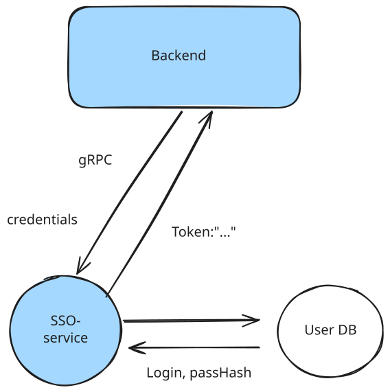

[](https://goreportcard.com/report/github.com/rwrrioe/sso)&nbsp;[](https://opensource.org/licenses/MIT)
[](https://github.com/rwrrioe/sso/releases)

## About

SSO service is a lightweight gRPC SSO authentication / authorization provider. Fully written in Golang. 

- Login / Register provider
- IsAdmin, other roles provider (authz)
- Password reset, email verification
- Cookies, session, logout (to be added)
  


## Quick start

1. Do git clone
```
git clone github.com/rwrrioe/sso
```

2. Install [Installation | Task](https://taskfile.dev/docs/installation) 

3. Build container
```
docker build
```

---

## Architecture

## Authentication pipeline




Our gRPC server calls Auth usecase. If it's register request, Auth calls repository and inserts credentials. We should add salt to our passHash before insertion. If it's login request, Auth compares hashes from user credentials and User DB. 


