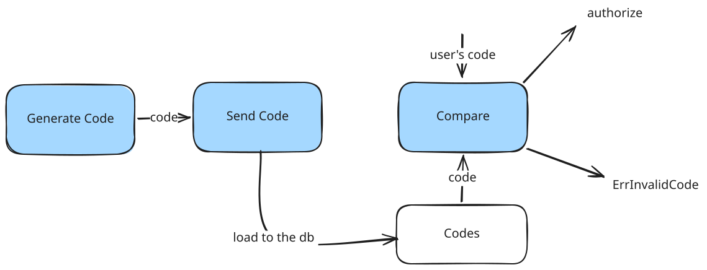
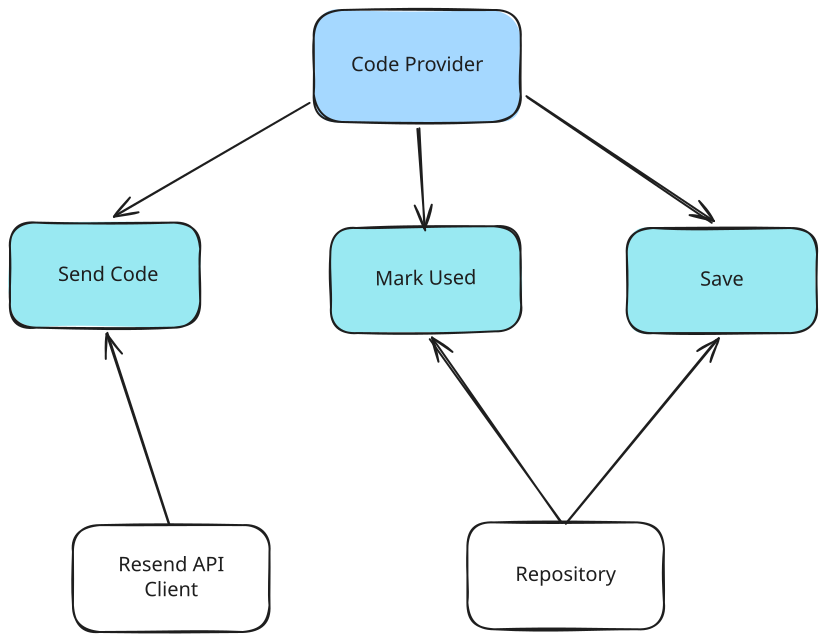

## General Mail Sending Pipeline

1) Generate verification / reset code
2) Send code via one of the adapters
3) Check if the code entered by user valid (whether it's the same code we've sent)
4) Authenticate (e.g. allow password reset, verify email, etc.)

## Code Sending & Validation Architecture

Code Sending & Validation is included in the Auth usecase. This usecase follows simplified version of the Clean Architecture principles.

Basically, we have ports (interfaces), and adapters (implementation of these interfaces). For example, we use Resend SDK Client, which would be port in this case.

 

## Further development

 - Move code sending flow to a distinct usecase
 - Add SMS-codes
 - Add 2FA

